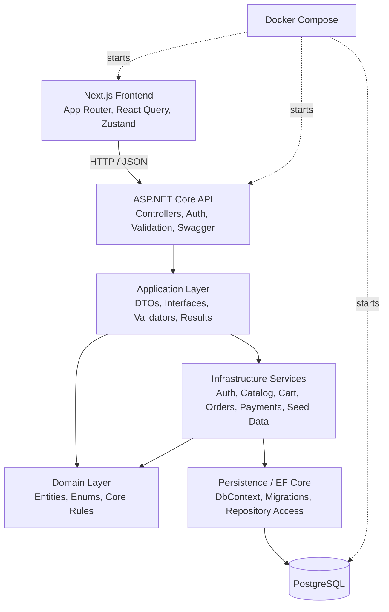

# ShopNow Architecture

ShopNow uses a layered backend and a separate Next.js frontend. The frontend calls the ASP.NET Core API over HTTP; the API owns authentication, authorization, business rules, and persistence. Docker Compose is provided for local development orchestration of PostgreSQL, the API, and the frontend.

## Backend

The backend is an ASP.NET Core Web API organized by Clean Architecture-style project boundaries.

- `Domain`: entities, enums, and shared entity base fields.
- `Application`: DTOs, service interfaces, result wrappers, validators, and application registration.
- `Infrastructure`: service implementations, JWT creation, BCrypt password hashing, and demo seed data.
- `Persistence`: EF Core `ApplicationDbContext`, entity configuration, migrations, and PostgreSQL setup.
- `API`: controllers, authentication, authorization, CORS, Swagger, validation filter, rate limiting, and global error handling.
- `Tests`: xUnit service-level tests for the main flows.

## Frontend

The frontend uses Next.js App Router and client-side feature modules.

- `app`: route pages and layouts.
- `features`: API wrappers grouped by domain, including auth, products, cart, orders, payments, and admin.
- `components`: shared UI, route guards, navbar, admin shell, and catalog/home components.
- `store`: Zustand auth state and persisted JWT/user data.
- `types`: shared TypeScript DTO types matching backend API responses.

## Database

PostgreSQL is accessed through EF Core. Main tables include users, categories, products, carts, cart items, orders, order items, and payments. Common query indexes exist for user email, product category/active state, product name, cart ownership, order ownership/status, and payment order lookup.
